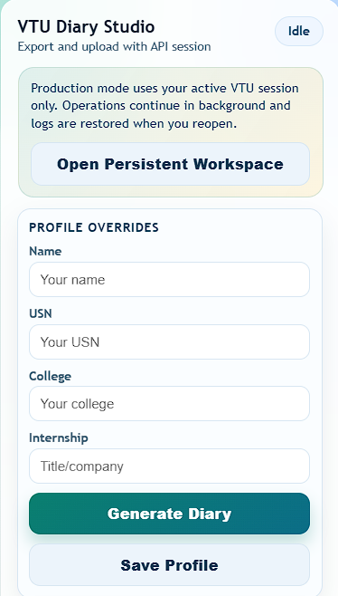
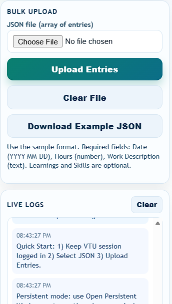
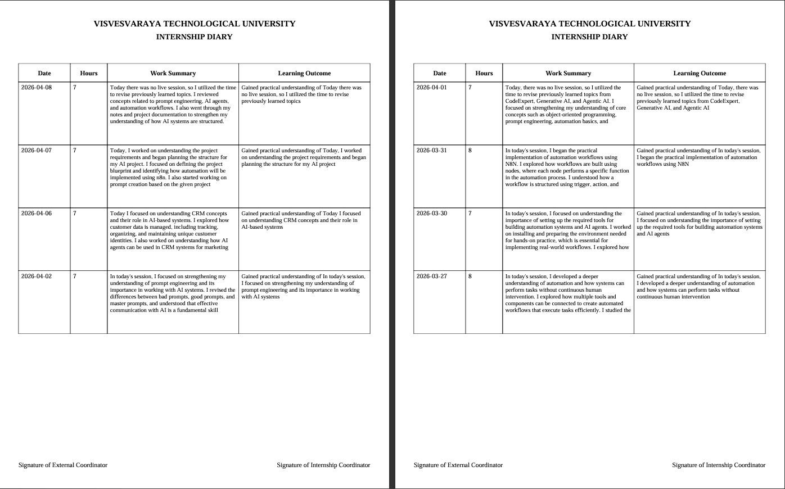

# VTU Diary Studio Chrome Extension

A production-focused Chrome extension for VTU internship diary workflows.

It helps you:
- Fetch submitted diary entries directly using your active VTU web session
- Generate clean PDF and DOC exports
- Bulk upload diary entries from JSON
- Persist logs and continue long operations safely

## Product Snapshot

VTU Diary Studio is designed for reliable day-to-day diary operations with minimal friction:
- Session-based workflow: no password storage and no UI automation hacks
- Background-first execution with resumable logs
- Flexible data normalization for real VTU API payload variations
- Safe text normalization for printable exports

## Screenshots

The screenshot names have been standardized to professional, descriptive filenames:

- [docs/screenshots/dashboard-profile-overrides.png](docs/screenshots/dashboard-profile-overrides.png)
- [docs/screenshots/bulk-upload-live-logs.png](docs/screenshots/bulk-upload-live-logs.png)
- [docs/screenshots/pdf-export-preview.png](docs/screenshots/pdf-export-preview.png)

<p align="center">
  
  
</p>



## Example JSON Download

- Repo file: [examples/2026-04-14.json](examples/2026-04-14.json)
- Direct download: [Download 2026-04-14.json](https://github.com/TheManishCode/vtu-diary-extension/raw/main/examples/2026-04-14.json)

## Core Capabilities

### 1) Export submitted diaries
- Reads diary entries from VTU API endpoints using existing authenticated browser session
- Extracts and merges profile details from API and fallback page sources
- Produces:
  - Internship_Diary.pdf (structured pagination, 4 entries per page)
  - Internship_Diary.doc (HTML-based Word export)

### 2) Bulk upload JSON
- Accepts a single object or array of entries
- Validates and normalizes fields before upload:
  - Date: YYYY-MM-DD
  - Hours: number from 1 to 24
  - Description: required
  - Learnings and Skills: optional
- Resolves internship and skill IDs through VTU API helper calls
- Uploads with retry handling and clear per-row logging

### 3) Persistent workspace and logs
- Opens extension UI in a persistent tab mode for long-running operations
- Stores runtime logs in chrome.storage.local and localStorage fallback
- Restores log history when popup reopens

## Architecture

- manifest.json
  - Manifest V3 extension definition
  - Permissions: activeTab, scripting, downloads, storage
  - Hosts: VTU web and VTU API domains
  - Service worker: background.js

- popup.html
  - Modern UI container and sections:
    - Profile overrides
    - Bulk upload
    - Live logs

- popup.js
  - UI state management and controls
  - Runtime messaging bridge to service worker
  - Local profile persistence
  - Log rendering and sanitization

- background.js
  - Main orchestration engine
  - Entry extraction and profile resolution
  - PDF/DOC generation
  - Upload validation, normalization, and API posting
  - Runtime log persistence

- content.js
  - Explicitly disables old UI automation hooks
  - Keeps workflow session-safe and API-driven

- examples/2026-04-14.json
  - Reference payload for bulk upload format

## JSON Upload Schema

Supported input keys are normalized from common variants:
- date / Date
- hours / Hours / hours_worked
- description / activity / work_description / workDescription / Work Description
- learnings / Learnings
- skills / Skills

Minimal valid example:

```json
[
  {
    "Date": "2026-04-14",
    "Hours": 4,
    "Work Description": "Implemented API integration and validated payload flow.",
    "Learnings": "Understood retry strategy and schema normalization.",
    "Skills": ["python"]
  }
]
```

## Local Development

1. Open Chrome and go to chrome://extensions
2. Enable Developer mode
3. Click Load unpacked
4. Select this project folder
5. Keep an active VTU session open on supported domains before running export/upload

## Packaging

1. Ensure manifest version and description are valid
2. Zip extension contents (not an extra parent folder layer)
3. Upload the zip to Chrome Web Store Developer Dashboard

## Operational Notes

- Upload and export rely on authenticated VTU cookies from your active browser session
- Operations are designed to continue in background while popup closes
- Logs are sanitized to avoid leaking sensitive endpoint details in the UI

## Disclaimer

This project is an independent workflow utility for internship diary management. Verify all generated and uploaded content before final submission to VTU.
